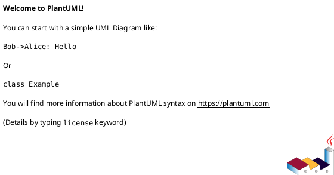

# Contributing to Industrial Automation PlantUML Repository

Thank you for contributing to our industrial automation process documentation! This guide will help you create and share effective PlantUML diagrams.

## File Naming Conventions

### Processes (`/processes/`)
- Use descriptive, lowercase names with underscores
- Format: `[system]_[process_name].puml`
- Examples: `packaging_line_control.puml`, `water_treatment_process.puml`

### Components (`/components/`)
- Focus on reusable system components
- Format: `[component_type]_[specific_name].puml`
- Examples: `motor_control_panel.puml`, `hmi_interface.puml`

### Examples (`/examples/`)
- Templates and learning materials
- Format: `[example_type]_[description].puml`
- Examples: `basic_plc_ladder.puml`, `scada_architecture.puml`

## PlantUML Best Practices

### 1. File Header
Always include a descriptive header:


### 2. Use Themes and Styling
```plantuml
!theme plain
title Your Process Title
```

### 3. Add Documentation
- Use comments (`'`) to explain complex logic
- Add notes for important information
- Include version control information

### 4. Structure Your Diagrams
- Use swimlanes for different actors/systems
- Group related activities with partitions
- Keep diagrams readable and not overly complex

## Types of Diagrams We Use

### Activity Diagrams (Process Flows)
Best for: Sequential processes, decision flows, workflows
```plantuml
start
:Process Step;
if (Decision?) then (yes)
  :Action A;
else (no)
  :Action B;
endif
stop
```

### Sequence Diagrams (System Interactions)
Best for: Communication between systems, timing diagrams
```plantuml
participant PLC
participant HMI
participant Database

PLC -> HMI: Status Update
HMI -> Database: Log Data
```

### Class Diagrams (System Architecture)
Best for: Component relationships, system structure
```plantuml
class Sensor {
  +readValue()
  +calibrate()
}
class PLC {
  +processLogic()
  +updateOutputs()
}
Sensor --> PLC : sends data
```

## Quality Guidelines

### Before Submitting
1. **Test your diagram**: Verify it renders correctly
2. **Check syntax**: Use PlantUML validator
3. **Review content**: Ensure accuracy of process representation
4. **Add documentation**: Include necessary comments and notes

### Code Review Checklist
- [ ] File follows naming convention
- [ ] Header information is complete
- [ ] Diagram is clear and readable
- [ ] Process steps are accurate
- [ ] Comments explain complex logic
- [ ] No syntax errors

## Tools and Resources

### Recommended Editors
- **VS Code**: PlantUML extension for real-time preview
- **IntelliJ IDEA**: PlantUML integration plugin
- **Online Editor**: [plantuml.com/plantuml](http://www.plantuml.com/plantuml/uml/)

### Learning Resources
- [PlantUML Official Guide](https://plantuml.com/guide)
- [PlantUML Activity Diagram Guide](https://plantuml.com/activity-diagram-beta)
- [PlantUML Sequence Diagram Guide](https://plantuml.com/sequence-diagram)

## Getting Help

1. Check existing examples in the repository
2. Review PlantUML documentation
3. Ask questions in pull request comments
4. Consult with team members familiar with the process

## Process for Large Changes

For significant additions or modifications:
1. Create an issue describing the proposed changes
2. Discuss the approach with maintainers
3. Break large changes into smaller, reviewable parts
4. Update documentation as needed

Thank you for helping build our automation process knowledge base!