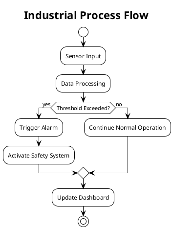

# PlantUML Files for Industrial Automation

This directory contains PlantUML diagrams for visualizing industrial automation processes, components, and systems.

## Directory Structure

- **`processes/`** - Complete industrial automation process diagrams
- **`examples/`** - Example diagrams and templates for common scenarios
- **`components/`** - Reusable component diagrams (sensors, actuators, controllers, etc.)

## Getting Started with PlantUML

### Installation

1. **Java**: PlantUML requires Java to run
2. **PlantUML JAR**: Download from [plantuml.com](http://plantuml.com/download)
3. **Graphviz** (optional but recommended): For advanced layouts

### Online Tools
- [PlantUML Online Server](http://www.plantuml.com/plantuml/uml/)
- [VS Code PlantUML Extension](https://marketplace.visualstudio.com/items?itemName=jebbs.plantuml)

### Basic Usage

1. Create a `.puml` file with your diagram code
2. Generate diagrams using:
   ```bash
   java -jar plantuml.jar your_diagram.puml
   ```

## Contributing

1. Follow the naming convention: `process_name.puml` or `component_name.puml`
2. Add descriptive comments in your PlantUML files
3. Include a brief description in the file header
4. Test your diagrams before committing

## Example Syntax



For more examples, check the `examples/` directory.